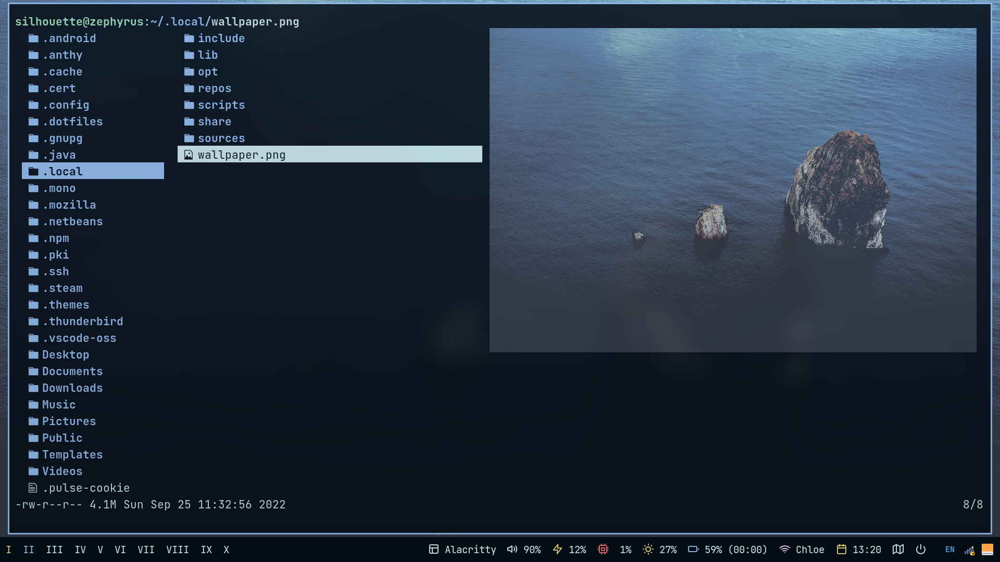
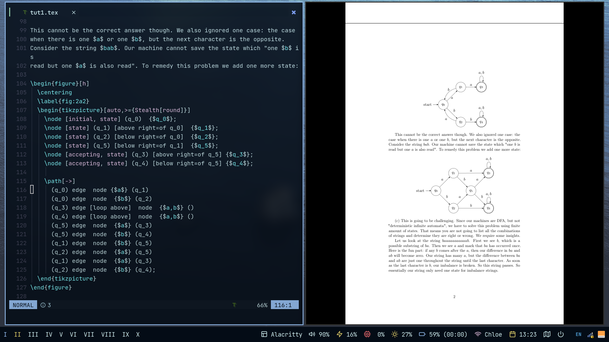

# Dotfiles

This is a `bspwm` setup, but unfinished. Currently, I am still using Gnome...
Clone this repository with `homeshick` if you want to read them locally.

## Some Pictures

Lf file manager with image preview and other file types (thanks to some scripts
on the Internet, I have no idea how to do it). By the way, the best image viewer
is sxiv.

On the left side, there is a configured neovim, and on the right side, there is
zathura.

If you are interested in any of this stuff, please read the config files. Thanks.
